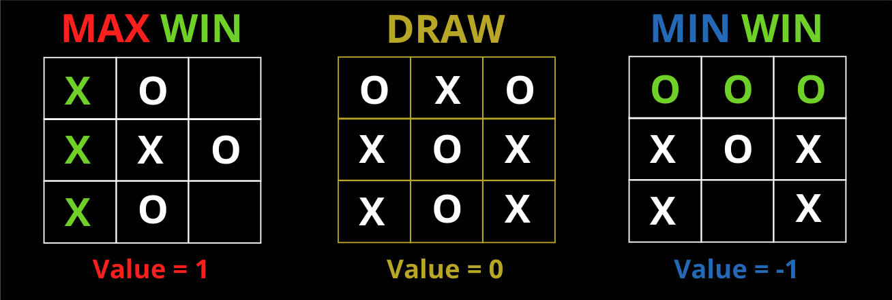
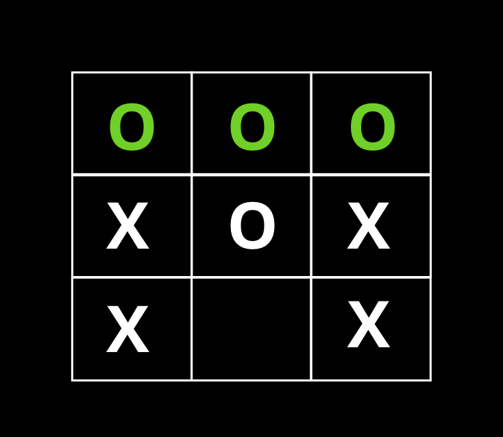
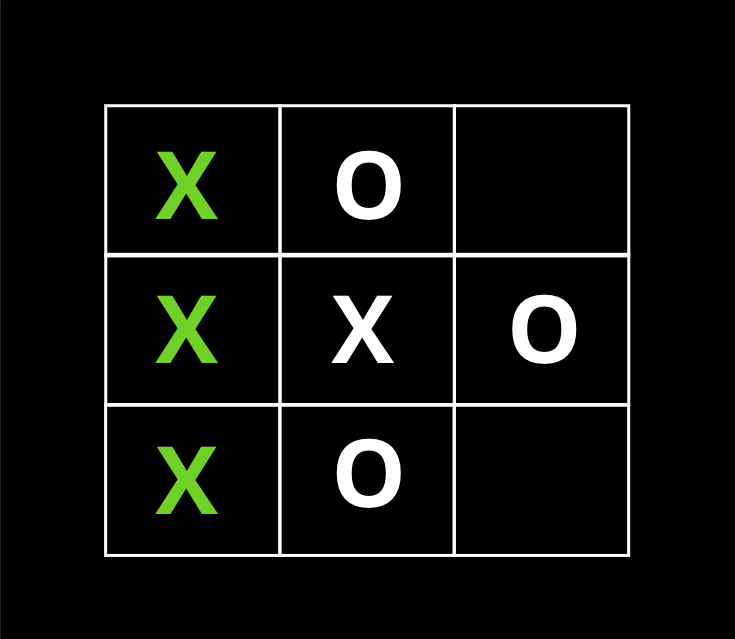
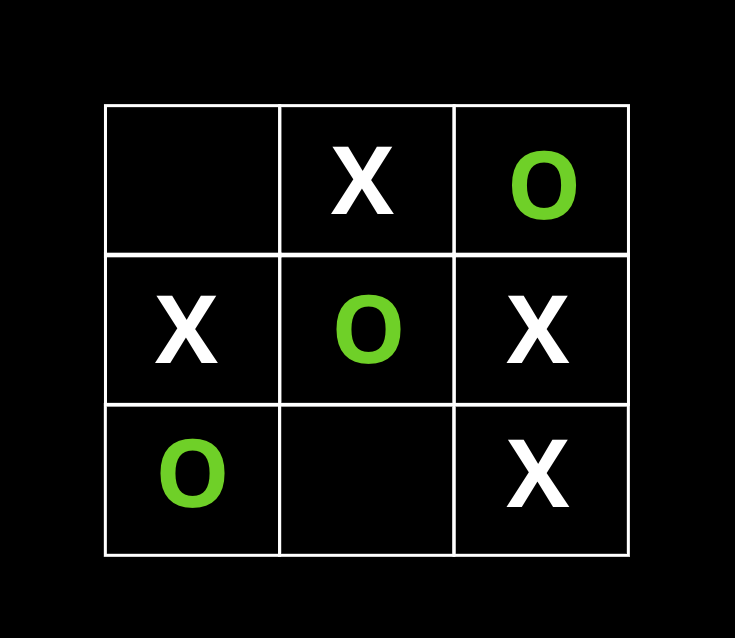

# Tic-Tac-Toe

## Adversarial Search Problem

- ### Area of AI: Planning

- ### Problem Description:

    In adversarial search problem, there are multiple adversaries, adversarial agents, that are trying to beat each other.
    Specifically for Tic-Tac-Toe, it is considered as a "Two-Player Zero Games" which basically just means that what is good for player 1 is just as bad for player 2 and the bad blood between players continue since there is no "Win-Win" option.
    In this game, there are 2 players, MIN for "O" and MAX for "X", who take turns moving until the game is over. Max aims to maximize the score and MIN wants to minimize the score. The game takes place on a 3x3 board with the initial state of 9 possible moves for MAX because MAX or "X" always begins (Now, you understand why MIN holds grudges on MAX!). In each move, MIN and MAX can only fill 1 tile on the 3x3 board. There are 3 possible result of the utility function in each game:

    
    
    The winner is defined by the occurence of one of these terminal states:
    
    - #### **Horizontal**

        

    - #### **Vertical**

        

    - #### **Diagonal:**
        - #### **Top Left to Bot Right**
        

        - #### **Top Right to Bot Left**

            

### Applied Algorithms: Minimax and Alpha-Beta Pruning

- #### **Minimax**

    Minimax performs the complete depth-first search exploration of the game tree. If the maximum depth of the tree is m and there are b legal moves in each turn then the time complexity is measured by O(b^m) and the space complexity is O(bm).

    Specifically in Tic-Tac-Toe, each state of the board is presented in each leaf node of the entire tree nodes taking the which player turn into consideration. Once MAX or MIN iterate ver the whole leaf nodes, the range of value between best possbile value and the actual value of either MAX or MIN will be set and the algorithm will return the best possbile one.

- #### **Alpha-Beta Pruning**

    Alpha-Beta Pruning is Minimax with the capability to prune (cut or ignore) any left nodes in the tree that will result in a faster decision making. THe general principle is that as soon as MAX find a value that is the highest for that leaf node, it will cut off the entire rest of the leave nodes starting that node going down. The value alpha and beta describe the bounds on the backed-up values that appear in each leaf node  along the path.

    - Alpha represents the value (best) of the best choice found so far at any node along the path of MAX; Also called "At least".
    - Beta represents the value (lowest) of the best choice found so far at any node along the path of MIN; Also called "At most".

    Time complexity in Alpha-Beta Pruning is O(b^m/2) and so the space complexity is O(bm/2).

- ### Results:

    TOBE UPDATED

### Location: https://github.com/Artificial-Ninoligence/SE14_AI-Basics/tree/main/01_Planning/tictactoe

Minimax => A generalization of AND-OR search
Pruning => just means ignoring portions of the search tree that make no difference to the optimal action (move).

"Leaf Node"

