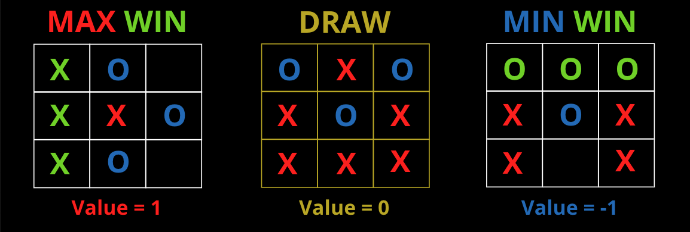

# Tic-Tac-Toe

# Adversarial Search Problem

- ### Area of AI: Planning

- ### Problem Description:

    In adversarial search problem, there are multiple adversaries, also called adversarial agents, that are trying to beat each other. One basic proposition is that all adversarial agents will 
    act as if their opponent always plays optimally (it doesn't matter if its another AI or a human player). The game Tic-Tac-Toe is alss considered the "Two-Player Zero Games" which basically just means that what is good for player 1 is just as bad for player 2 and the bad blood between players continue since there is no "Win-Win" option.
    
    In this game, there are 2 players, MIN for "O" and MAX for "X", who take turn moving until the game is over. Max aims to maximize the score and MIN wants to minimize the score. The game takes place on a 3x3 board with the initial state of 9 possible moves for MAX because MAX or "X" always begins (Now, you understand why MIN holds grudges on MAX!). In each move, MIN and MAX can only fill 1 tile on the 3x3 board. At the end of the game, points are awarded to the winning player and penalties are given to the loser! This game can be formally defined by these following functions:

    1. **board**  Representation of each **state**

    2. **initial_state(board)**  The **starting state** of the board (9 possible moves for X)
        
        

    3. **player_move(board)**  Deciding **player's turn** based on the board progression (MIN or MAX)
        
        

    4. **moves(board)**  A set of legal **moves** on the board
        
        

    5. **result(board, move)**  A **transition model** which defines the state resulting from **choosing a move** on the board
        
        

    6. **winner(board)**  A set of rules that define a **winner** needs 3 **X** or 3 **O** **consequtively** in a **horizontal**, **vertical**, or **diagonal** line, otherwise return none
        
        

    7. **terminal(board)**  A test which is **true** when the game is **over** and **false** if **otherwise**. The game ends with the so called **terminal state**

        

    8. **utility(board)**  Also called **objective function** or **payoff function**, is an assignment of the final numeric value to the player when the game is in the terminal state

          

    For **Games**, AI researchers often use the words **Board** or **Position** as synonyms of **Action**, where as **Move**as the synonym of **Action**.

## Applied Algorithms: Minimax and Alpha-Beta Pruning

In this section, I will visually explain the so called **state space graph** which is a graph where the **vertices** are states (or boards in our case), the **edges** are actions (or moves in our case), and a state might be reached by multiple paths. The graph is also called the **game tree** which is a **search tree** that follows every sequence of moves **all the way** to a terminal state.

- #### **Minimax**

    **"Minimizing the possible loss for a worst case scenarion which is the maximum loss."**

    Minimax performs the complete depth-first search exploration of the game tree. It is a recursive algorithm that proceeds all the way to the leaves of the tree and then backs up the minimax values through the trees as the recursion unwinds. The algorithm will always start exploring the very left path of the tree into its very last leaf and then goes 1 hierarchy up, to then goes down the path right from its previous path.    
    
    If the maximum depth of the tree is n and there are b legal moves in each turn then the time complexity is measured by . and the space complexity is  Mathematically, minimax algorithm is written as

    .

    In Tic-Tac-Toe, each state of the board is presented in each leaf node of the entire tree. In each turn, MAX will iterate over all possible states which are valued numerically as a sign to show that one state is better than the other states. Max choses the highest value possible after comparing it to a helper value which is  or the worst possible value for MAX. MIN does exactly the same steps but unlike MAX, MIN choses the lowest possible value after comparing it to its worst possible value which is .

- #### **Alpha-Beta Pruning**

    Alpha-beta pruning is Minimax with the capability to prune (cut or ignore) any node left in the tree that will result in a faster decision making. THe general principle is that as soon as MAX find a value that is higher or equal to beta, it will cut off the entire rest of the leaves nodes that haven't been explored. For MIN, it will cut the rest of the leaves node if the value is smaller or equal to the value of alpha. The value alpha and beta describe the bounds on the backed-up values that appear in each leaf node  along the path.

    -  represents the value (best) of the best choice found so far at any node along the path of MAX; Also called "At least" with the starting value of .
    -  represents the value (lowest) of the best choice found so far at any node along the path of MIN; Also called "At most" with the starting value of .

    Time complexity in alpha-beta pruning with even is  and so the space complexity is . This means that alpha-beta with perfect ordering can solve a tree approximately twice as deep as minimax in the same amount of time.

- ### Results:

    In general, the right implementation of both algorithms will result in an undefeatable adversarial agent. Of course, it will not always win either, but at least it will always be a draw!

    - MINIMAX

      - AI as O Player:

        - Result is a draw

            

        - Time Complexity and states exlpored

            

        - Conclusion:

            Nothing special here! The adversarial agent MIN was pretty aggresive and did some good moves that made me lost once.

      - AI as X Player:

        - Most optimal starting state on the board

            

        - Result is a draw

            

        - Time Complexity and states explored

            

        - Conclusion:

            The adversarial agent MAX took a almost 8 seconds to start the game and I realized it has a prefered move (see starting state image above). This is because this particular state somehow got rendered first into the leaf node and since each tile has the same value because MAX starts first, it chose the first rendered initial state. The game style is ever more aggressive that as MIN adversarial agent. I lost twice in total. 

    - Alpha-Beta Pruning
  
      - AI as O Player:

        - Result is a draw

            

        - Time Complexity and states exlpored

            

        - Conclusion:

            The adversarial agent was aggressive as in minimax algorithm, but the time consumed to choose its move was faster than minimax agent.

      - AI as X Player:

        - Most optimal starting state on the board

            

        - Result is a draw

            

        - Time Complexity and states explored

            

        - Conclusion:

            The adversarial agent started the game way faster than the minimax MAX agent. It is almost the same amount of time as if the adversarial agent is playing as MIN instead of MAX. Surprisingly, the initial state (or move) chosen is different than the move from minimax MIN agent. The only explanation is that the moment the second board in coordinate (0, 1) was rendered, MAX compared its value with the first board which is (0, 0). Since both result in 0 and in the code it says for MAX either bigger than or equal to the previous value, MAX must prune the rest of the node tree. This is why the adversarial agent of alpha-beta pruning always started at the coordinate (0, 1). The game style is very aggressive, I lost twice as well here in total. The agent is undisputable!
    
    - Conclusion for both algorithms

        The pros about Minimax algorithm is supposedly to generate the most optimal move because it explores all possible state in each iteration, where as alpha-beta pruning only explores until the best possible value is better than the previous value relative to the value of the opponent. In other words, the moment alpha-beta found a better value or equal to the value of the opponent, it cuts off the rest of the tree, leaving them un-explored. Nevertheless, I haven't experienced that alpha-beta did worst than minimax which is contradicting the pros and cons from both algorithms. This might caused by the game itself that is too simple for the algorithm.
### Location: https://github.com/Artificial-Ninoligence/SE14_AI-Basics/tree/main/01_Planning/tictactoe
