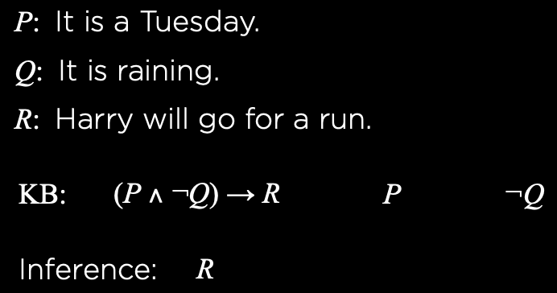
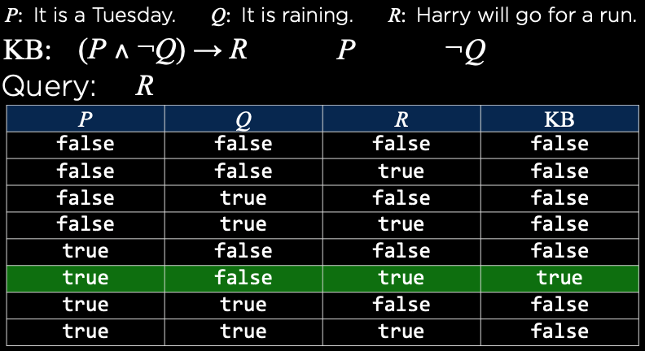
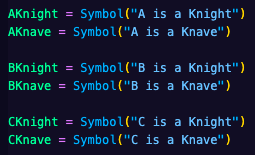
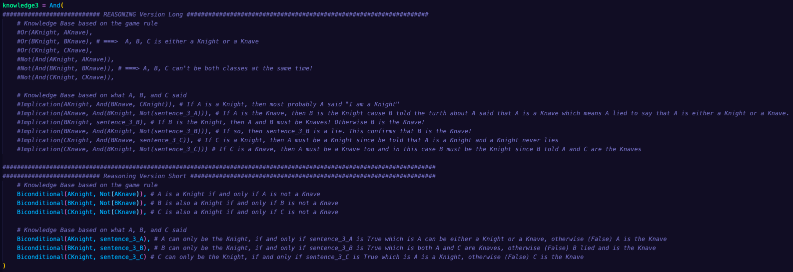

# Knights and Knaves

# Knowledge and Reasoning Problem

- ### Area of AI: Knowledge

- ### Problem Description:
    
    "Knights and Knaves" is a logical puzzle written by Raymond Smullyan in 1978. In this puzzle, the initial knowledge is given:

    1. Each character can only be either a knight or a knave.
    2. A knight will always tell the truth - If a knight said a sentence, it is always true.  
    3. A knave will always lie - If a knave said a sentence, it is awlays false.
    
    The objective of this logical puzzle is to decide who is the knight and who is the knave for all characters.
    
    The file "logic.py" contains:

    1. Sentence class - To check if the sentence or sentences typed in by the player follow the syntaxing rule.
    2. Symbol class - To represent the sentence (same as propositional symbols).
    3. All logical connectives classes - These classes can be composed within each other to construct a complex sentence.
    4. model_check function - To enumerate all possible models to check that all assignments of "True" and "False" through the logcal connective classes is true in all models in which the knowledge base is true.

    The file "puzzle.py" contains 4 different scenes with characters A, B, and in one case C who say a sentence or two. This file is where the player do the work!

## Applied Algorithms: Inference Algorithm with Model Checking Approach

- **Terminology**

  1. Knowledge Base (KB) - A set of sentences.
  2. Sentence - A physical configuration of the agent.
  3. Reasoning - A process of constructing new physical configurations from old ones.
  4. Knowledge Representation Language - A language that represents some assertions of the world.
  5. Atomic sentence - A sentence consists of a single propositional symbol.
  6. Axiom - a new sentence contains knowledge that is not derived from any other "known" sentences.
  7. Complex senmtence - A new sentence constructed from other simpler sentences using logical connectives.
  8. Literal - There are 2 literals:
    - Positive literal - An atomic sentence,
    - Negative literal - A negated atomic sentence.
  9. Syntax - A rule that defines the allowable sentences.
  10. Semantics - The meaning of sentences.
  11. Logic - An interdisciplinary field which studies truth and reasoning and which applies syllogism.
  12. Declarative Approach - Telling the agent all sentences one by one until the agent knows how to operate in its environment.

- **Knowledge-Based Agent**
  
    In the knowledge and reasoning problem, there is logical agents or "Knowledge-Based" agents that use reasoning over the representation of knowledge to decide which actions to take. The core of a knowledge-based agent is the so called "Knowledge Base" (KB) which technically described as a set of sentences in which each sentence is expressed in a language called a "Knowledge Representation Language".
    A knowledge-based agent has the ability to add new sentences and also to query what is known from inside its knowledge base. The standard names for both operations, "Adding" new sentences and "Querying" known sentences, are "Tell" and "Ask". A knowledge-based agent starts with an empty knowledge or initia knowledge. There are 2 possibilities to add sentences to an agent, firstly using the "Declarative Approach", and/or secondly, we can provide a KB with a mechanism to learn new sentences by itself (a combination between "Knowledge and Reasoning" field and "Learning" field).

- ### **Entailment**

    To be able to explain what an inference algorithm does, we need to understand to concept of entailment. In logical reasoning there is an involvement of logical entailment between sentences which is the idea that a sentence follows logically from another sentence. Mathematically, this idea is written
    
    

    
    
    The formal definition of entailment is that the sentence $\alpha$ entails the sentence $\beta$ if and only if in every model in which $\alpha$ is true, $\beta$ will also be true. This is written as 
    
     iff .
    
    Now, the connection between entailment and inference algorithm is that the entailment is applied to derive conslusions that will carry out the logical inference. To understand it better, think of "Entailment" as a needle in a haystack and the inference is the process to find it.

    

- ### **Propositional Logic**

    In this project, I applied the so called "Propositional Logic" which is the branch of logic that studies ways of joining and/or modifying entire propositions, statements or sentences to form more complicated propositions, statements or sentences, as well as the logical relationships and properties that are derived from these methods of combining or altering statements. To implement propositional logic, we always need to describe its syntax and semantics which will derive a syntactic algorithm for logical inference that implement the semantic notion of entailment. The syntax of propositional logic defines the allowed numbers of sentences. Propositional logic has the so called "Propositional Symbols" that can be connected by the "Logical Connectives".
    
    

    Propositional symbols are arbitrary uppercase letters in which each letter used to represent the proposition that can be either "True" or "False".
    
    

    Logical connectives are operators that construct complex sentences from simpler ones. There are 5 connectives:

    1. A sentence such as $\neg P$ is pronounced the negation of $P$.

        

    2. And connective is also called "Conjunction".

        

    3. Or connective is also called "Disjunction".

        

    4. Implication such as $(P \wedge Q) \Rightarrow \neg R$ has 2 parts. The $(P \wedge Q)$ is called "Premise" or "Entecedent" and $\neg R$ "Conclusion" or "Consequent". The right arrow symbolizes the "Implication".

        

    5. Biconditional $\Leftrightarrow$ symbolizes "If and only if". The below figure might get confusing, but let's take the first row. The first row says that the biconditional is true. This is because $P$ is false and $Q$ is also false. Biconditional is true if and only if $P$ and $Q$ have the same truthy or falsy value.

        

- ### **Inference Algorithm with Model Checking Approach**

    Inference is the process of deriving new sentences from the old ones.
    
    
    
    The inference algorithm is generally notated as

    $$
    KB|=\alpha
    $$

    One of the approach for inference algorithm is the model checking approach which is used in this project. Models in inference algorithm are just the assignment of true or false to every proposition symbol:
        
    
    
    Model checking works by enumerating all possible models to check that $\alpha$ is true in all models in which KB is true, or mathematically written

    $$
    M(KB)\subseteq M(\alpha)
    $$

    

    - Example of "Model-Checking Approach":

    

    

    

    - Inference Rules
        To make it easier to use the connectives, there are inference rules that can be used in inference algorithm. In all the figure below, the line separates the sentence (on the top part) and consequent on the bottom:

        1. Modus Ponens

            

            - Translated to propositional symbols and connectives:

                

        2. And Elimination

            

            - Translated to propositional symbols and connectives:

                

        3. Double Negation Elimination

            

            - Translated to propositional symbols and connectives:

                

        4. Implication Elimination

            

            - Translated to propositional symbols and connectives:

                

        5. Biconditional Elimination

            

            - Translated to propositional symbols and connectives:

                

        6. De Morgan's Law (And to Or)

            

            - Translated to propositional symbols and connectives:

                

        7. De Morgan's Law (Or to And)

            

            - Translated to propositional symbols and connectives:

                
            
    - Property of Inference - Distributive
          
        1. And - Distributivity:

            

        2. Or - Distributivity:

            

- ### Results:

    Firtsly, Sentences that are valid for all puzzles:

    

    Secondly, don't forget the 3 basic rules of the puzzle which is considered also as the Knowledge Base:

      1. Each character can only be either a knight or a knave.
      2. A knight will always tell the truth - If a knight said a sentence, it is always true.  
      3. A knave will always lie - If a knave said a sentence, it is awlays false.

    Thirdly, my approach is to first translate the sentence said by any character into a complex sentence that will serve as an added knowledge base for the agent. Then, using declarative approach, I tell the agent about the all knowledge base starting the ones from the rules of the game, hence I have a pretty clear structured separated by the comment "Knowledge Base basd on the Game Rule" and "Knowledge Base based on what A, B, or C said".

    Since the implementation was pretty easy, I wrote down 2 reasonings fro each puzzle: "Reasoning Version Long" using "Or", "Not" and "And", and "Implication, and also "Reasoning VErsion Short" using "Biconditional" and "Not".

1. Puzzle 0:

    - Added Knowledge base based on what A said:

        

    - Implemented Knowledge by declarative approach:

        

    - Result:
        
        Since being both claseses at the same time is against the game rule and character B doesn't want or can't say that B is also both classes at the same time, this concludes that A must be lying, hence A is the Knave. Since B can't lie, hence B is the knight.

        

2. Puzzle 1:
   
    - Added Knowledge base based on what A said:

        

    - Implemented Knowledge by declarative approach:

        

    - Result:
        
        Almost the same logic as by puzzle 0, but here character A said a sentence that is against the game rule which is A and B can only be either a knight or a knave. Each character being both at the same time is prohibited and both characters having the same classes (a knave and a knave or a knight and a knight) is also prohibited. In my implementation, the decisive point is where I added the sentence that A is actually a knight if B can confirm that B is actually a knave which by nature is impossible since it is prohibited by the game rule, but the machine doesn't know that.

        Since I explained this in my approach strategy and the approach for the result is always the same, I will stop writting in the next puzzles and let my comments guide you.

        

3. Puzzle 2:
   
    - Added Knowledge base based on what A and B said:

        

    - Implemented Knowledge by declarative approach:

        

    - Result:

        

4. Puzzle 3:

    - Added Knowledge base based on what A, B, and C said:

        

    - Implemented Knowledge by declarative approach:

        

    - Result:

        

### Location: https://github.com/Artificial-Ninoligence/SE14_AI-Basics/tree/main/02_Knowledge%26Reasoning/knightsandknaves