# Crosswords

# Constraint Satisfaction Problem

- ### Area of AI: Optimization

- ### Problem Description:

  1. #### **General Problem in CSP**

    A Constraint Satisfaction Problem (CSP) is defined by:
    - X is a set of n variables (X1, ..., Xn), each defined by a finite domain (D1, ..., Dn) of possible values.
    - C is a set of constraints C1, ..., Cm, each Ci involves a subset of the variables that specifies the allowable combinations of values for that subset.
    
    A solution for CSP is achieved through an assignment of values to the variables that satisfies all constraints.

    - Constraint types:

      1. Hard Constraints - Must be satisfied in a correct solution.
      2. Soft Constraints - Expression of some notion of which solution are preffered over others.
      3. Unary Constraint - A constraint involving only 1 variable, i.e. {A ≠ Monday}.
      4. Binary Constraint - A constraint involving 2 variables, i.e. {A ≠ B}.
      
    - Consistency's types:

      1. Node Consistency - When all the values in a variable's domain satisfy the variable's unary constraints.
      2. Arc Consistency - When all the values in a variable's domain satisfy the variable's binary constraints:
          - In order to make some variable X arc-consistent with some respect to some other variable Y, we need to remove any element from X's domain to make sure that every choice of X domain has a possible choice of Y

    -  CSP Property:
        
        1. Commutative Property - In crossword puzzle, this means simply that it doesn't matter, if we have 2 x 3 (horizontal or vertical) squares, if we want to assign "eat" to the first square and "see" to the second square or the other way around.     

  2. #### **Crossword Puzzle**

    The problem in the crossword puzzle is the assignment of each different word for each variable such that the unary, binary, and extra constraints are satisfied.
    
    The idea of a crossword puzzle is generating the crossword puzzle structure and the list of words to choose from that will fit into the structure (horizontal and vertical squares). Each sequence of squares is 1 variable, for which we need to decide on its value, i.e. which word in the domain of possible words will fill in the sequence.

    - The Constraints

      1. Unary Constraint - Constraint by the length of the variable (number of letters), i.e. for variable 1, the value "Eyes" would satisfy the constraint, but "Eye" would.
      2. Binary Constraint -  Constraint on variables that verlap with their neighbours, i.e. variable 1 has a single neighbour: Variable 2. Variable 2 has 2 neigbours: Variable 1 and variable 3. Each of these 3 variables will be sharing a single square that is common to them both, hence they are overlapping.
      3. Preference Constraint - The same word can't be repeated in the puzzle.

    - Approach to Constraints

      1. Removing any values from the variable's domain that don't satisfy a variable's unary constraints.
      2. Overlap between variable 1, 2, and 3 (from the above example) will be first represented as the pair (1, 0) for variable 1 and 2 which means that variable 1's character at index 1 necessarily must be the same as variable 2's character at index 0 (assuming 0-indexing, again). The overlap between variable 2 and 3 would therefore be represented as the pair (3, 1) which means the character 3 of variable 2's value must be the same as character 1 of variable 3's value.

    - Consistency

      1. Arc-Consistency - Every variable in this puzzle is "arc-consistent" whenever every value in its domain satisfies the variable's binary constraints.

## Applied Algorithms: Backtracking Search

- #### **Pseudo Code**

  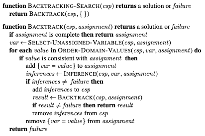

- #### **Constraint Propagation Process**

  CSP algorithms, unlike an atomic state-search algorithm, have 2 options to make progression. It can generate a successors by choosing a new variable assignment, or it can do "Constraint Propagation". Constraint propagation is the process of reducing the number of legal values using the constraints for a variable which can reduce the legal values for another variable continuously. The main goal of constraint progpagation is to leave fewer options to consider whenever the algorithm decides the next choice of a variable assignment. Since this happens before the actual search is activated, it can even sometimes solve the whole problem!

- #### **CSPs as Search Problem**

  - Initial State - Empty assignment (no variables)
  - Actions - Add a {variable = value} to the assignment
  - Transition Model - Showing how adding an assignment changes the assignment
  - Goal Test - Checking if all variables are assigned and if all constraints are satisfied
  - Path Cost Function - All paths have the same cost

- #### **Backtracking Search for CSPs**

  Constraint propagation is a great inference method, but it is not perfect. Sometimes, it leaves behind variables with multiple possible values and this is where "Backtracking" finishes the job! This algorithm is modeled on the recursive version of depth-first search Backtracking search only keeps a single representation of a state and alters that representation rather than creating new ones. In Backtracking search algorithm for CSP, the algorithm repeatedly chooses an unassigned variable and iterates over all possible values in the domain of that variable (in turn), trying to extend each one of them into the solution in a recursive manner. If the execution is successful, it returns the solution. If it failed, it will restore the previous state and tries the next assignment. At the end, if no value works  for the assignment, then it will return "No Solution".

  Backtracking search algorithm ca be improved using the "Domain-Independent Heuristics" that take advantage of the factored representation of constraint satisfactory problems.

- #### **Heuristic Approach**

  The purpose of heuristic appraches is to sort the variable and/or value ordering:
  
    - Degree heuristic: assign a value to the variable that is involved in the largest number of constraints on other unassigned variables.
    - Minimum remaining values (MRV): choose the variable with the fewest possible values.
    - Least-constraining value heuristic: choose a value that rules out the smallest number of values in variables connected to the current variable by constraints.

- ### Results:

  - CS50 Edition:
    
    1. First Crossword Puzzle - Structure0.txt and Words0.txt

        - Result

          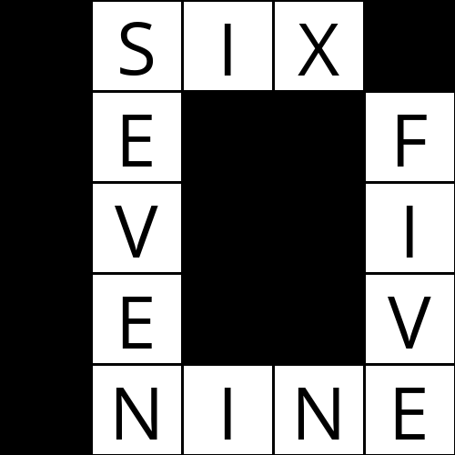

        - Time Complexity

          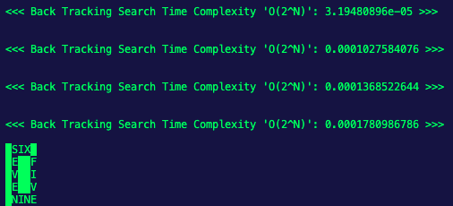

    2. Second Crossword Puzzle - Structure0.txt and Words0.txt

        - Result

          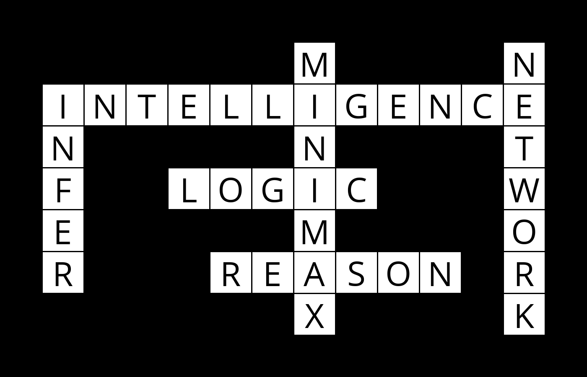

        - Time Complexity

          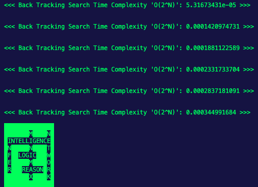

    3. Third Crossword Puzzle - Structure0.txt and Words0.txt

        - Result

          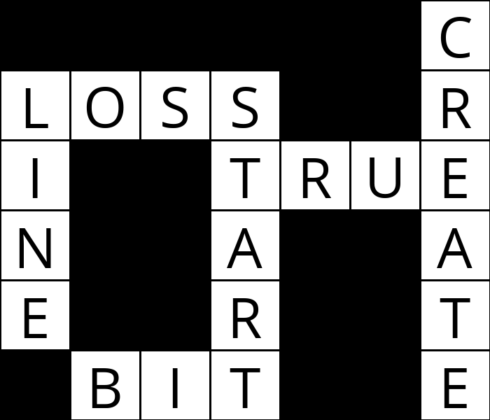

        - Time Complexity

          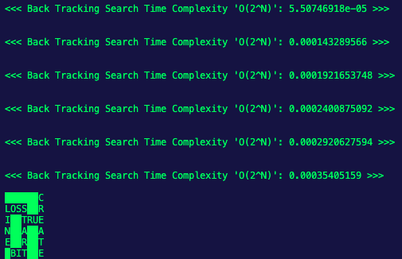

  - Special Experimental Edition:  
    
    1. Fourth Crossword Puzzle - Structure4_Special.txt and Words0.txt

        - Result

          

        - Time Complexity

          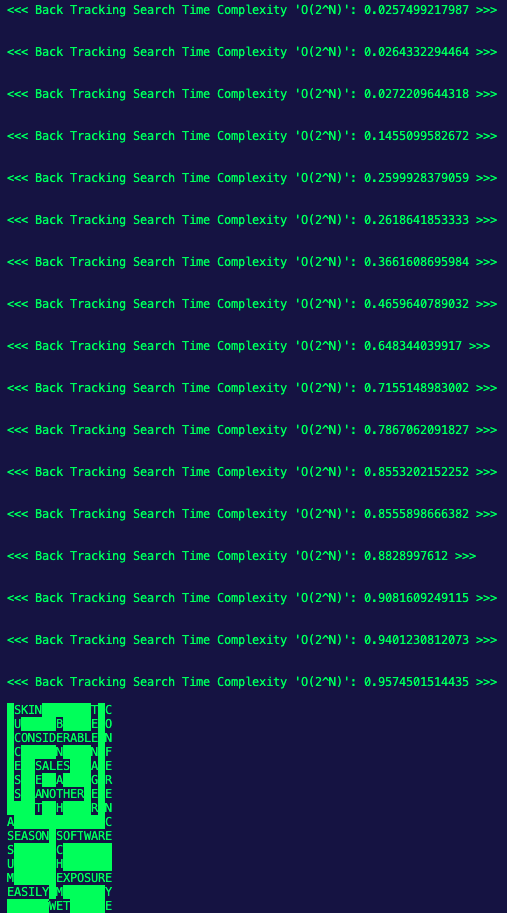

    2. Fifth Crossword Puzzle - Structure5_Special.txt and Words0.txt

        - Result

          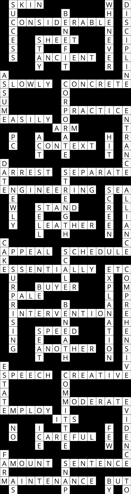

        - Time Complexity

          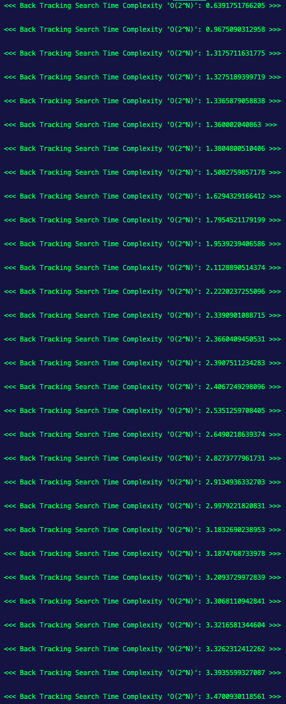

          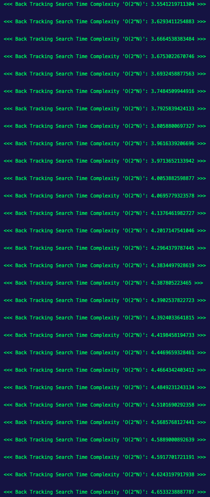

          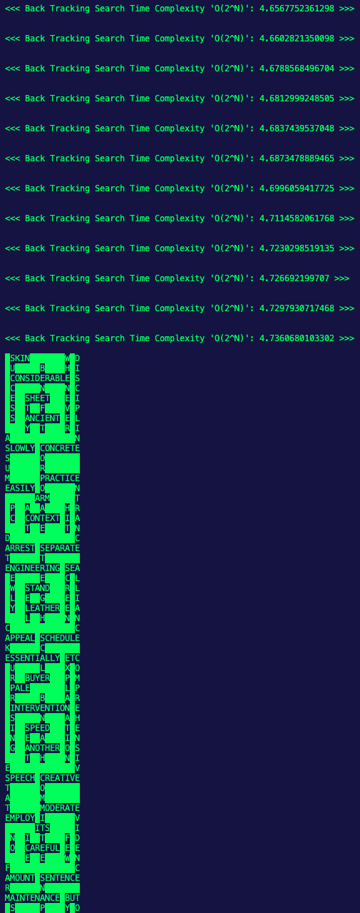

### Location: https://github.com/Artificial-Ninoligence/SE14_AI-Basics/tree/main/03_Optimization/crosswords
