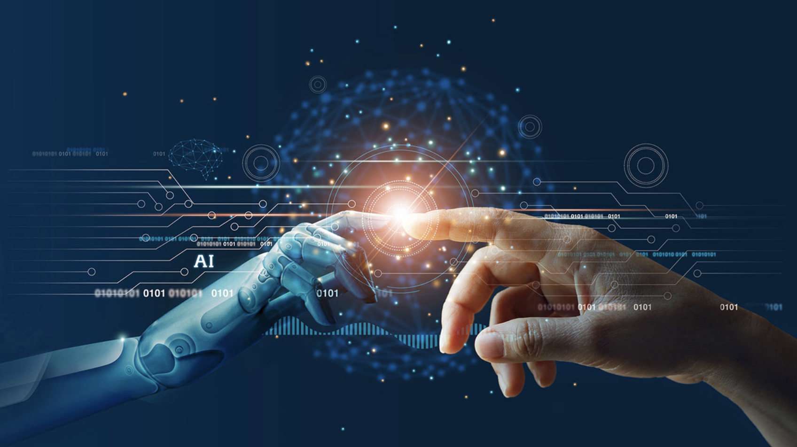

# Artificial Intelligence Basics

#### Student Name: Nino Lindenberg
#### University: CODE University of Applied Sciences
#### Study: Software Engineering (B.Sc.)
#### Semester: Fall Semester 2021 / Third Semester
#### Module: SE14_AIBasics
#### Module Coordinator: Frank Trollmann, Ph.D.

# Content

1. Introduction
2. The 4 Areas of AI
3. Projects:

    - [Planning: Tic Tac Toe]()
    - [Reasoning: Knights and Knaves]()
    - [Optimization: Crosswords]()
    - [Learning: Nim]()

4. Learning Resources

# Introduction

## Motivation
"Artificial Intelligence" is among today's most popular topics because many have understood that this field will help us surpass our limits, but a commonly [forgotten fact](https://www.kdnuggets.com/2018/02/birth-ai-first-hype-cycle.html#:~:text=While%20artificial%20intelligence%20(AI)%20is,cycle%20between%201956%20and%201982.) says that this field was born in 1950 and also went through the "hype-era" between 1956 and 1982. After reading ["Life 3.0: Being Human in the Age of Artificial Intelligence"](https://en.wikipedia.org/wiki/Life_3.0) by Max Tegmark and write and essay about it in my second semester, I decided that I want to major AI. The book revealed the both the potential dangers and potential advantages to develop the AI domain further. After wighing the scale with both pros and cons, I believe that there is a way to ensure that AI will develop for the sake of humanity and I want to be a part of it. This is when I really decided that I want to major in AI.

## SE14_AIBasics
In this module, students are taught about the fundamental knowledge of artificial intelligence using Python, but without using any frameworks/libraries; At least up to the topic "Machine Learning". For me, I see that the module is divided into 3 parts:
    1. Terminologies, Philosophy, and Meanings
    2. Algorithms used in AI programming
    3. Mathematics

The first part enables me to communicate within the AI domain, to understand the motivation of AI development, and to grasp the potentials of AI technologies. For the second part, algorithms, students get dirty in coding with Python using its mathematical library and data visualization library; Numpy and Matplotlib. The mathematical part enlightens students about the dynamic happening under the hood of the algorithms. To showcase the knowledge gained through the semester, I decided to do 4 projects that cover the 4 areas of AI. These projects are also used in [CS50's INtroduction to Artificial Intelligence with Python](https://cs50.harvard.edu/ai/2020/) from 2020.

## The 4 Areas of Artificial Intelligence

1. Reasoning - A process that use an internal representation of knowledge extracted by the logical techniques "induction" and "Deduction" to decide what actions to take (AMAAI, p. 226).
2. Planning - The task of finding sequence of actions to accomplish a goal in discrete, deterministic, static, fully observable nvironment (AMAAI, p. 362).
3. Optimization - A field of AI which which explores the process of finding input values for a function such that the output value of that function is maximal or minimal ([AI Guild - Asynchronous Learning, Optimization](https://classroom.google.com/u/0/w/MTIxNDc0NDk4NDY4/tc/MzM4MjgyOTc1NDFa)).
4. Learning - The ability of an agent to improve its performance after making observations about the world (AMAAI, p. 669).

## Projects

- Tic Tac Toe - Implementation of minimax and alpha-beta pruning algorithms to solve "adversarial search and games" problem
- Knights and Knaves - Implementation of a knowledge-based agent: How to make our AI reasons logically
- Crosswords - Implementation of backtracking search algorithm to solve the constaint satisfaction problems
- Nim - Implementation of reinforcement learning algorithm

## Learning Resources
1. [Google Classroom: AI Guild - Asynchronous Learning](https://classroom.google.com/u/0/c/MTIxNDc0NDk4NDY4)
2. [Google Classroom: SE_14 - Artificial Intelligence Basics](https://classroom.google.com/u/0/c/MzA1Mzk0ODY0MTI3)
3. [Artificial Intelligence: A Modern Approcah, 4th Global Edition](http://aima.cs.berkeley.edu/global-index.html)
4. [Russel, J. and Norvic, P. (2021). Artificiall Intelligence: A Modern Approach. 4th Global edn. Pearson Education 2021.](https://www.amazon.de/Artificial-Intelligence-Modern-Approach-Global/dp/1292401133/ref=asc_df_1292401133/?tag=googshopde-21&linkCode=df0&hvadid=500783497845&hvpos=&hvnetw=g&hvrand=15265746337720976469&hvpone=&hvptwo=&hvqmt=&hvdev=c&hvdvcmdl=&hvlocint=&hvlocphy=9043086&hvtargid=pla-1219002048885&psc=1&th=1&psc=1)
5. [CS50: Introduction to Artificial Intelligence with Python](https://cs50.harvard.edu/ai/2020/)